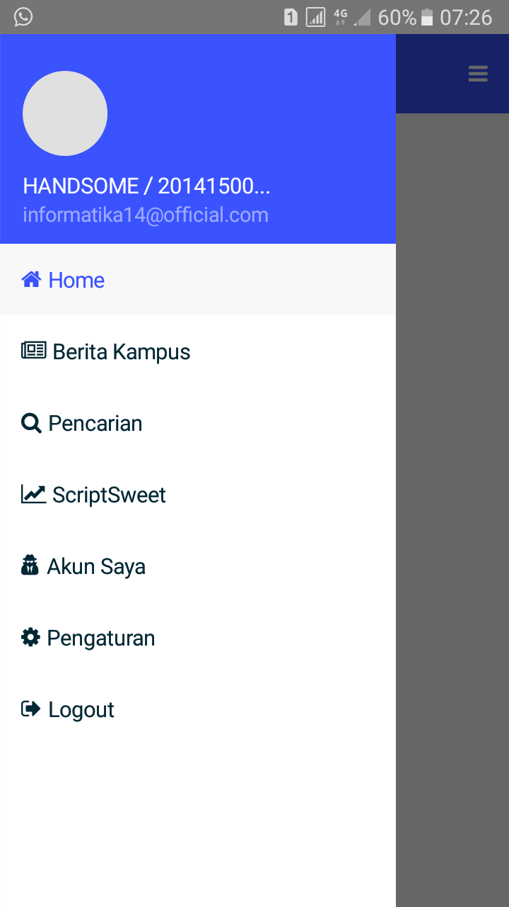

# WARNING!!!
Belum uji coba pada platform IOS

# Assigment 3
Android & IOS Native {NativeScript} dan Frontend Angular dengan Backend Laravel sebagai APInya

# About
ScriptSweet adalah aplikasi mobile yang diperuntukkan bagi mahasiswa bimbingan skripsi. Berawal dari Assignment 2 -> https://github.com/harrikr/SampleLarAngu
		

  			
		

namun pada mobile ini ditambah berbagai fitur dan dikembangkan sedemikian rupa  
		

  			
		

# Contribute

See our profile --> https://github.com/harrikr (2014150040) --> https://github.com/rifaiazis) (2014150055) and --> https://github.com/SuciAnugraheni (2014150070)

